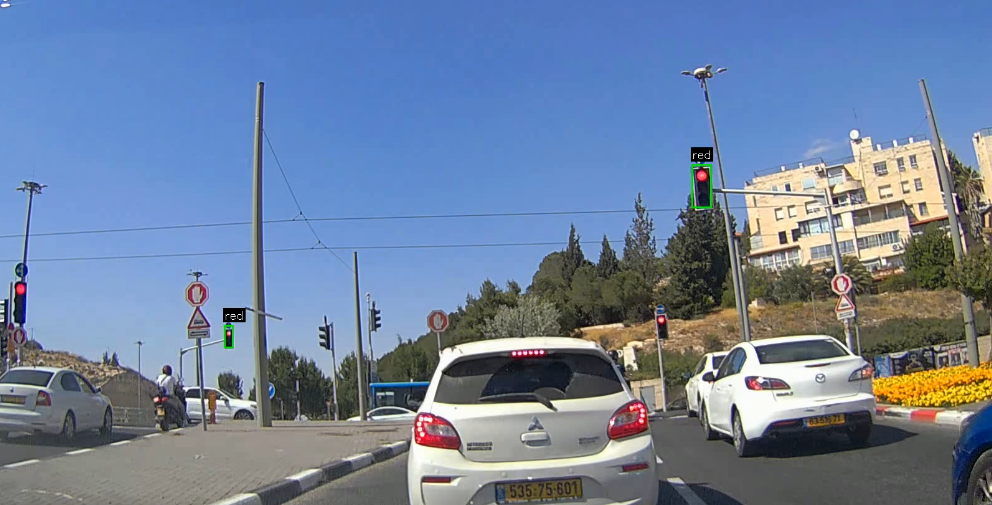
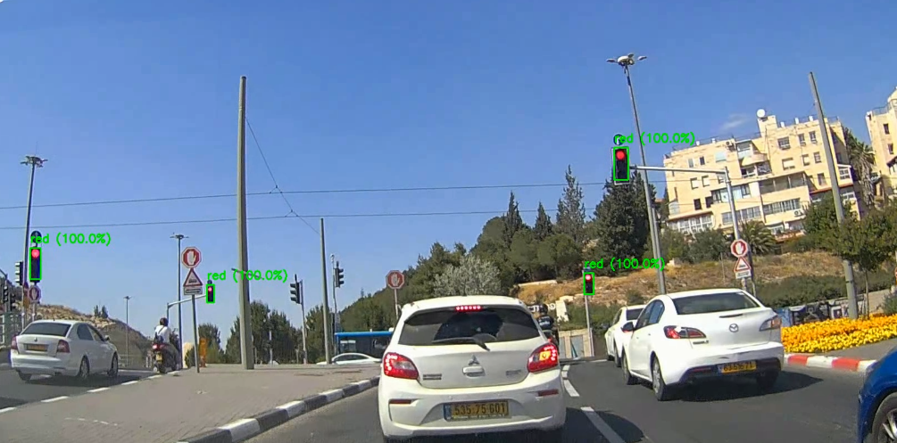
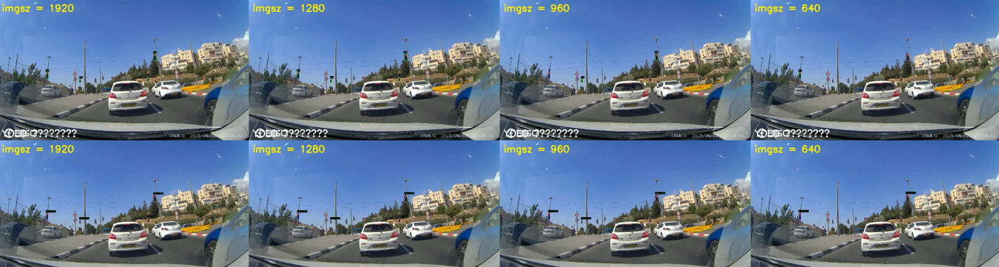
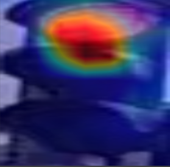
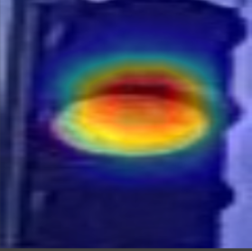
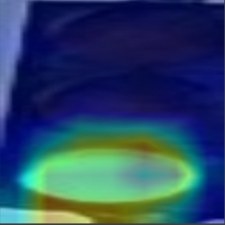

# 🚦 Traffic Light Detection & Classification – YOLO vs YOLO+CNN

This repository presents a smart, modular system for detecting traffic lights and classifying their signal state (**red**, **yellow**, **green**). It compares two approaches:

1. **YOLO-only**: Detection and classification combined within the YOLO bounding box model.
2. **YOLO + CNN**: YOLO handles detection only, and a separate CNN performs classification.

The project demonstrates the advantages of separating the detection and decision-making stages for better robustness, accuracy, and flexibility.

---

## 🧠 Project Motivation

In real-world scenarios like autonomous driving or traffic monitoring, traffic lights appear as **small**, **distant**, and sometimes **partially occluded** objects. Many models struggle to detect them reliably — and even when detected, classifying the **light signal** can be tricky under shadows, night conditions, or glare.

To address this, I built a **hybrid system** that mimics human behavior:

> First we locate the traffic light, then we look carefully to identify the active color.

---

## 🧩 Tools & Technologies Used

| Component       | Tool/Framework       | Purpose                                                             |
| --------------- | -------------------- | ------------------------------------------------------------------- |
| Detection       | YOLOv8 (Ultralytics) | Fast and accurate traffic light detection in images and video       |
| Classification  | PyTorch + Custom CNN | Lightweight classifier to determine signal state (red/yellow/green) |
| Data Processing | OpenCV, NumPy        | Image cropping, preprocessing, resizing                             |
| Visualization   | Matplotlib, Pillow   | Annotated output images and GIF generation                          |
| Automation      | Python scripts       | Batch processing and evaluation pipeline                            |

---

## 🧪 Methodology Overview

### 1. **YOLO-only Pipeline**

* A single YOLOv8 model is trained to detect traffic lights **and** predict their state directly.
* Works well when lights are clearly visible.
* Struggles with complex backgrounds, bright sunlight, or occlusions.

### 2. **YOLO + CNN Hybrid Pipeline**

* YOLOv8 detects bounding boxes around traffic lights only.
* Each cropped light is passed to a separate CNN trained on labeled crops.
* Classification is more accurate and consistent.
* Allows tuning detection and classification models independently.

---

## 📊 Quantitative Comparison (Confidence = 0.8)

| Metric                  | YOLO-only                            | YOLO + CNN                     |
| ----------------------- | ------------------------------------ | ------------------------------ |
| Detection Accuracy      | Medium (misses some small lights)    | High (better generalization)   |
| Classification Accuracy | Lower (misclassifies similar colors) | High (color-specific training) |
| False Positives         | Moderate                             | Very low                       |
| Flexibility             | Low                                  | High (modular)                 |
| Interpretability        | Hard to debug                        | Easy to separate issues        |

## 📷 Visual Comparison at Confidence Threshold = 0.8

To evaluate both detection strategies under stricter confidence settings (conf = 0.8), we compared the output of YOLO-only vs. YOLO + CNN pipelines.  
Higher confidence thresholds reduce false positives but often cause missed detections — highlighting model robustness.

---

### 🔹 YOLO-Only Output

In this example, the detection and classification are done inside YOLO.  
You can see that some lights are missed or uncertain due to shape, distance, or lighting.



---

### 🔸 YOLO + CNN Output

In this setup, YOLO detects traffic lights, and each crop is sent to a CNN for signal classification.  
This modular separation improves robustness and reduces misclassification.



---

### 🎯 Observation

At high confidence thresholds, the hybrid approach (YOLO + CNN) proves more reliable —  
successfully identifying lights that YOLO alone either misses or mislabels.


## 🖼️ Resolution Sensitivity: YOLO-only vs YOLO + CNN

The following image compares how each model performs when input images are resized to different resolutions:  
**1920 × 1080**, **1280 × 720**, **960 × 540**, and **640 × 360**.

| Top row    → YOLO-only         | Bottom row    → YOLO + CNN |

As input size decreases, detection becomes harder — especially for small traffic lights.



---

### 📌 Insights

- At higher resolutions (e.g., `imgsz=1920`), both models perform relatively well.
- As resolution drops, **YOLO-only begins to miss or misclassify lights**, while **the hybrid model remains more stable** due to better local signal classification.
- This demonstrates the **robustness of the modular approach**, especially under hardware constraints or video compression (e.g., dashcams, embedded systems).

## 📦 Download Pretrained Models

You can download the trained models used in this project from the following links:

- **YOLOv8 – all COCO classes:**  
  [Download](https://drive.google.com/file/d/1JFyOcf-URedVqBN75cJy-uJvGmTDCD27/view?usp=drive_link)

- **YOLOv8 – traffic light detector only:**  
  [Download](https://drive.google.com/file/d/1qMRlc7DgiwvgdTSmahEFlCb2MmKha3Ti/view?usp=drive_link)

- **CNN traffic light classifier:**  
  [Download](https://drive.google.com/file/d/1UmoKKbhXeZbOfl3wLezBZYP-dC5opyml/view?usp=drive_link)


## 🧠 CNN Heatmaps – Model Attention Visualization

The following heatmaps show where the CNN classifier focuses when predicting the traffic light state.  
They were generated using activation visualization techniques (e.g., Grad-CAM or feature maps) and help explain **how** the model makes its decision.

<p align="center">
  
  
  
  
</p>

<p align="center">
  <b>Red</b> &nbsp;&nbsp;&nbsp;&nbsp;
  <b>Orange</b> &nbsp;&nbsp;&nbsp;&nbsp;
  <b>Green</b> &nbsp;&nbsp;&nbsp;&nbsp;
  <b>Red & Orange (ambiguous case)</b>
</p>

These visualizations highlight the **regions the CNN considers important** when classifying each signal.  
They also expose how the model reacts to ambiguous or multi-colored inputs.


## 📂 Project Structure

```
traffic-light-detector/
├── src/
│   ├── detect_and_classify.py
│   ├── yolo_pipeline.py
│   └── classifier.py
├── comparisons/
│   ├── yolo_only/result_conf_08.png
│   └── yolo_plus_cnn/result_conf_08.png
├── models/
│   └── best.pt  # YOLO weights
├── runs/
│   └── classified_outputs/  # annotated images
├── requirements.txt
└── README.md
```

---

## 🙋‍♂️ About Me

Created by **Ohad Marhozi**, Electrical Engineering student with a focus on embedded systems, computer vision and deep learning. I built this system to explore modularity in vision pipelines and demonstrate how simple tools, when separated wisely, can outperform complex end-to-end models.

For collaborations or questions, feel free to reach out!

---

📅 2025 · Smart Mobility · Deep Learning · Vision Systems
